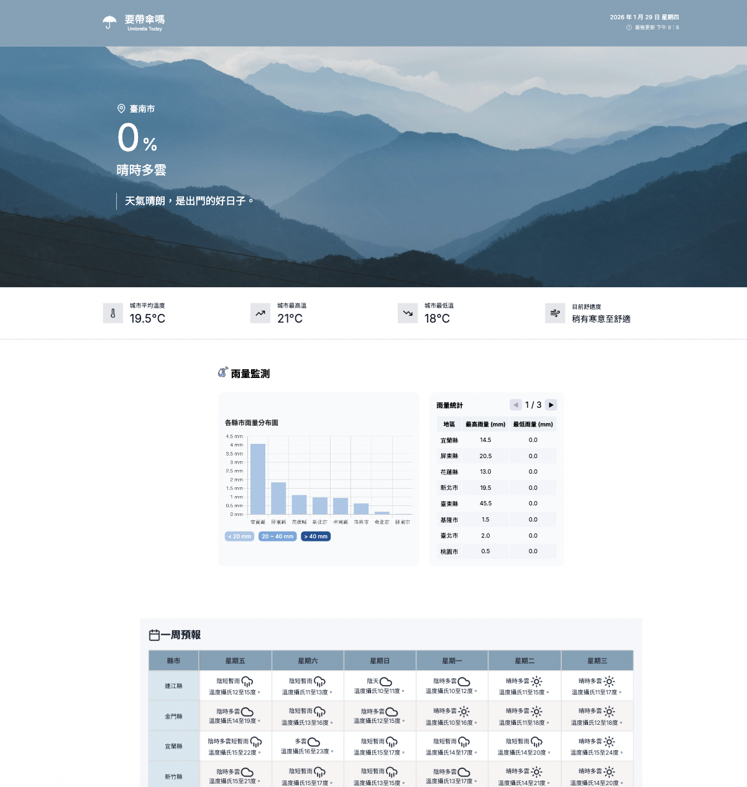

# 要帶傘嗎 Umbrella Today

> 出門前的最後一件事



## 專案簡介

結合生在多雨地區的台灣人，出門最常問的一個問題「要帶傘嗎?」

以一頁式網站簡潔呈現今日至未來一週天氣狀況，無論是不知道要穿多厚的衣服、想了解旅行目的地是否在下雨、或為接下來一週做好準備，最重要的是——面對還在猶豫「要帶傘嗎」的你，這就是最適合你的網站！

## 成果展示

 **線上展示**｜ https://shih3807.github.io/team-weather/

## 團隊分工

| 組員 | 負責區塊 | 功能說明 |
|------|----------|----------|
| 詩晴 | 頁首 - 即時降雨率 | 定位服務、帶傘建議 |
| 愛倫 | 雨量監測 | 全台雨量數據統計、視覺化長條圖、分頁表格 |
| 惠宇 | 一週預報 | 未來一週天氣預報、溫度趨勢表格 |

### 開發流程

1. **前期規劃**：使用 Figma 設計網頁架構與功能區塊
2. **版本控制**：在 GitHub Repository 建立 `index.html` 並劃分各區塊
3. **協作開發**：
   - 各組員獨立開發負責的 CSS 與 JS 檔案
   - 使用 `.prettierrc` 統一程式碼格式，避免合併衝突
4. **整合測試**：確保各功能區塊正常運作
5. **部署上線**：透過 GitHub Pages 發布


## 專案特色

相比傳統以溫度為導向的氣象網頁，「要帶傘嗎」以雨量、降雨機率為主:
- ☔ 網站頁首提供**所在地降雨機率**及**是否要帶傘的建議訊息**
- 📊 視覺化圖表呈現**全台各地雨量統計**
- 📅 未來一週**天氣狀況與溫度指引**

## 技術架構

- **前端技術**: HTML、CSS、JavaScript
- **圖表視覺化**: Chart.js
- **資料來源**: 
  - 氣象資料：中央氣象署開放資料平台
  - 定位服務：BigDataCloud API
- **部署平台**: GitHub Pages

## 如何使用

1. 開啟網站 [https://shih3807.github.io/team-weather/](https://shih3807.github.io/team-weather/)
2. 瀏覽器會要求提供定位權限
   - ✅ **允許定位**：獲得更精準的氣象資訊
   - ❌ **拒絕定位**：以 IP 位置為準（預設為台北市）
3. 查看三大區塊資訊：
   - **即時天氣**：當前降雨機率、溫度、舒適度
   - **雨量監測**：全台雨量統計與分布圖
   - **一週預報**：各縣市未來一週天氣與溫度

## 專案結構

```
team-weather/
├── index.html              # 主要 HTML 檔案
├── css/
│   ├── common.css          # 共用樣式
│   ├── current-weather.css # 即時天氣樣式
│   ├── daily-rainfall.css  # 雨量監測樣式
│   └── regional-overview.css # 一週預報樣式
├── js/
│   ├── config.js           # API 金鑰設定
│   ├── current-weather.js  # 即時天氣功能
│   ├── daily-rainfall.js   # 雨量監測功能
│   └── regional-overview.js # 一週預報功能
└── image/                  # 圖片資源
```

## API 使用說明

本專案使用以下 API：

### 中央氣象署開放資料平台
- 一般天氣預報：`F-C0032-001`
- 雨量觀測資料：`O-A0002-001`
- 鄉鎮天氣預報：`F-D0047-091`

### BigDataCloud 定位服務
- Reverse Geocoding API（免費版）

> ⚠️ 注意：由於資料來源為台灣中央氣象署，若定位不在台灣地區，系統會預設為台北市。

## 資料來源與致謝

- 定位服務：由 BigDataCloud 提供
- 資料來源：本平台氣象資料由中央氣象署提供，僅供參考使用。實際天氣狀況請以氣象署最新發布為準。

## 授權

本專案為學習專案，僅供教學與展示使用。